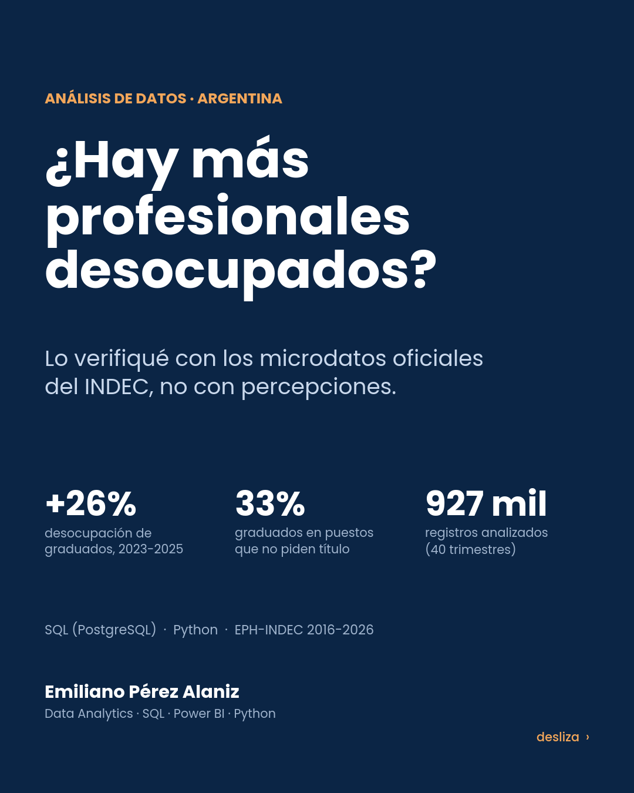

# ¿Hay más profesionales desocupados en Argentina?

**Análisis de la desocupación de graduados con microdatos oficiales de la EPH (INDEC), 2T2016 – 1T2026**

Autor: Emiliano Pérez Alaniz · SQL (PostgreSQL) · Python · Visualización de datos



## La pregunta

Desde 2024 se escucha cada vez más que "hay más profesionales sin trabajo". Este proyecto busca responder con datos oficiales si eso es cierto y a quién afecta.

## Veredicto

**La percepción es real, pero hay matices.**

| Indicador (promedio anual, 31 aglomerados) | 2019 | 2023 | 2025 | 1T2026 |
|---|---|---|---|---|
| Tasa de desocupación, **superior completo** | 3,87% | **2,51%** | **3,17%** | 3,56% |
| Graduados desocupados (promedio, miles) | 119 | 84 | 107 | 123 |
| Tasa de desocupación, secundario completo | 10,82% | 6,93% | 7,96% | 8,92% |
| Tasa de desocupación, total | 9,84% | 6,14% | 7,38% | 7,83% |
| Graduados ocupados en puestos operativos o no calificados | 27,7% | 31,8% | 32,9% | 34,2% |
| Graduados asalariados sin descuento jubilatorio | 14,6% | 14,5% | 15,8% | 16,3% |
| Gran Mendoza, tasa total | 8,27% | 5,08% | 6,56% | 7,32% |

1. **La desocupación de graduados subió dos años seguidos**: de 2,51% a 3,17% entre 2023 y 2025. Es un aumento relativo del 26% y representa unos 23 mil graduados desocupados más.
2. **Fue la suba relativa más alta** entre los grupos analizados: el total subió 20% y el secundario completo, 15%.
3. **El título protege menos.** En 2023, quien solo terminó el secundario tenía 2,76 veces más desempleo que un graduado. En 2025, esa relación bajó a 2,51 veces.
4. **Los más afectados son los graduados de 25 a 44 años** (2,82% → 3,61%) **y los de título terciario** (3,38% → 4,35%).
5. **La sobrecalificación crece.** Uno de cada tres graduados ocupados trabaja en puestos operativos o no calificados. En 2019 eran el 27,7%; en el 1T2026, el 34,2%.
6. **La informalidad de los graduados está en máximos.** En el 2T2025, el 17,1% de los asalariados con título trabajaba sin aportes jubilatorios, el valor más alto de la serie.
7. **Gran Mendoza empeoró más rápido que el país.** Su tasa pasó de 5,1% a 6,6% entre 2023 y 2025. En el 2T2026 llegó a 8,1% según el dato oficial, por encima del total nacional (7,9%), algo que no ocurría desde 2021.

**Los matices.** La tasa de graduados sigue por debajo de la de 2019 y es menos de la mitad que la de quienes solo terminaron el secundario. Si se compara el mismo trimestre de cada año, las variaciones de graduados no siempre son estadísticamente significativas. Por eso las conclusiones se apoyan en promedios anuales y en la consistencia de varios indicadores que apuntan en la misma dirección.

## Datos y validación

- **Fuente:** INDEC, Encuesta Permanente de Hogares (EPH continua), base `usu_individual`, 40 trimestres (2T2016 – 1T2026). Son 927.739 registros de personas activas, ponderados con `PONDERA`.
- **Validación:** la tasa de desocupación total calculada coincide con la publicada por el INDEC en todos los trimestres controlados.

| Trimestre | Cálculo propio | INDEC oficial |
|---|---|---|
| 2T2019 | 10,64% | 10,6% |
| 2T2023 | 6,24% | 6,2% |
| 4T2023 | 5,73% | 5,7% |
| 2T2024 | 7,56% | 7,6% |
| 2T2025 | 7,58% | 7,6% |
| 1T2026 | 7,83% | 7,8% |

Gran Mendoza también coincide: 2T2019, 8,78% frente a 8,8% oficial; 2T2023, 5,33% frente a 5,3%.

## Definiciones

| Concepto | Definición EPH |
|---|---|
| Tasa de desocupación | Σ `PONDERA` (ESTADO = 2) / Σ `PONDERA` (ESTADO ∈ {1, 2}) |
| Graduado / superior completo | `NIVEL_ED` = 6 |
| Tipo de título | `CH12`: 6 terciario, 7 universitario, 8 posgrado |
| Sobrecalificación | Ocupados con calificación del puesto (5° dígito de `PP04D_COD`) = 3 operativa o 4 no calificada. Se completan los ceros a la izquierda perdidos. |
| Informalidad | Asalariados (`CAT_OCUP` = 3) con `PP07H` = 2 (sin descuento jubilatorio) |
| Error estándar | Aproximación de Kish, √(p(1−p)/n_eff) con n_eff = (Σw)²/Σw². Es conservadora a la baja porque ignora el diseño por conglomerados. |

## Estructura

```
data/eph_resultados.csv            indicadores agregados (758 filas), insumo de todo el análisis
sql/01_schema.sql                  modelo: hechos persona-trimestre, dimensiones, tabla de indicadores
sql/02_indicadores_desde_microdatos.sql   vistas que calculan tasas + error estándar desde microdatos
sql/03_analisis.sql                validación, tendencias, brecha educativa, calidad del empleo, Mendoza
etl/procesar_eph.py                ETL reproducible: zips del INDEC → CSV para PostgreSQL
etl/extraccion_navegador.js        extracción efectivamente usada (agregación en el navegador)
etl/graficos_carrusel.py           gráficos y carrusel (matplotlib)
docs/img/                          láminas PNG · docs/Carrusel_...pdf
```

## Cómo reproducir

```bash
# 1. Descargar los zips "EPH_usu_XTrim_AAAA_txt.zip" desde
#    https://www.indec.gob.ar/indec/web/Institucional-Indec-BasesDeDatos  → data/raw/
python etl/procesar_eph.py data/raw
psql -f sql/01_schema.sql
psql -c "\copy eph.fact_persona_trimestre FROM 'data/processed/fact_persona_trimestre.csv' WITH (FORMAT csv, HEADER true)"
psql -f sql/02_indicadores_desde_microdatos.sql

# Análisis directo sobre los indicadores publicados en este repo
psql -c "\copy eph.indicadores FROM 'data/eph_resultados.csv' WITH (FORMAT csv, HEADER true)"
psql -f sql/03_analisis.sql

# Gráficos
pip install pandas matplotlib img2pdf
python etl/graficos_carrusel.py
```

## Limitaciones

- La EPH cubre 31 aglomerados urbanos; no representa a la población rural.
- Los años 2016 (3 trimestres) y 2026 (solo el 1T) están incompletos. Las comparaciones anuales usan 2017–2025.
- El 2020 está distorsionado por la pandemia.
- Gran Mendoza tiene una muestra chica: entre 20 y 30 graduados desocupados por año. Las tasas de graduados en Mendoza son orientativas.
- Los microdatos del 2T2026 todavía no están publicados. Para ese trimestre se usa la tasa oficial del informe de prensa del INDEC.

## Fuentes

- INDEC, [Bases de datos EPH](https://www.indec.gob.ar/indec/web/Institucional-Indec-BasesDeDatos) (microdatos `usu_individual`).
- INDEC, [Mercado de trabajo, tasas e indicadores socioeconómicos (EPH)](https://www.indec.gob.ar/indec/web/Nivel4-Tema-4-31-58), informes de prensa trimestrales.
